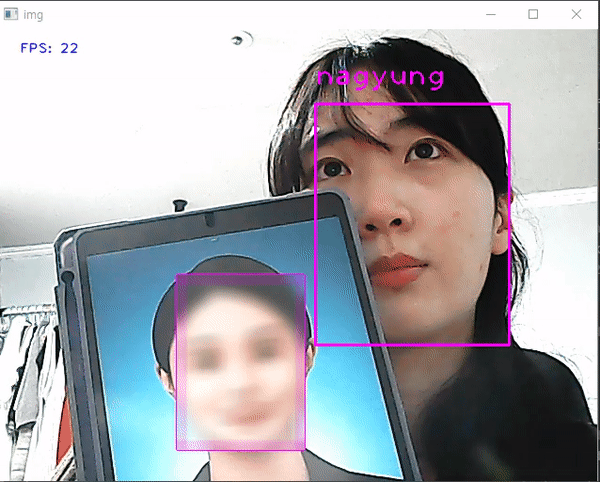

## Realtime_Face_Mosaic_Using_MediaPipe

### 1. How to use?
* You can crop your face and save features runing get_save_features_cam.py or get_save_feautures_pic.py
* check your files and cropped images in the images directory 
* run face_recognition_realtime.py - will mosaic recognized faces
* run face_recognition_realtime_cctv.py - will save videos into the cctv directory

### 2. Result 

### 3. What's the difference from 'Realtime_Face_Mosaic' project?
* We substituted  MTCNN face detection model with MediaPipe open source which was released in 2020 by Google
* By replacing it, we got lighter realtime recognizing and mosaicing model which can be used in small devices
* we did test this model in Jetson Nano, and the result was better than the model using MTCNN

### 4. Reference
* https://google.github.io/mediapipe/solutions/face_detection 
* https://github.com/TropComplique/mtcnn-pytorch
* https://github.com/Xiaoccer/MobileFaceNet_Pytorch